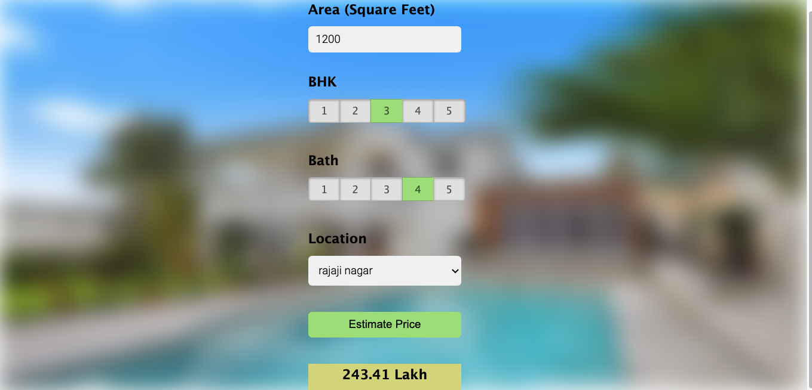

# Over all work description for this machine learning warmup project

##### This data science project taught me how to develop a real estate price prediction website step by step. First, I created a model with sklearn and linear regression using data from kaggle.com's Bangalore house prices dataset. The second step would be to create a python flask server that serves http requests using the stored model. The third component is a website developed in html, CSS, and javascript that allows users to enter information such as home square footage, bedrooms, and so on, and then calls a Python Flask server to receive the anticipated price. Almost all data science techniques, including as data load and cleaning, outlier identification and removal, feature engineering, dimensionality reduction, gridsearchcv for hyperparameter tuning, k fold cross validation, and so on, were taught to me during model development. This project involves technology and tools.
1. Python
2. Numpy and Pandas for data cleaning
3. Matplotlib for data visualization
4. Sklearn for model building
5. Jupyter notebook, visual studio code and pycharm as IDE
6. Python flask for http server
7. HTML/CSS/Javascript for UI

# Full View of House Prediction
